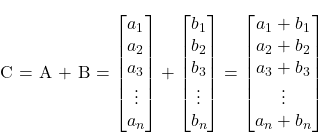
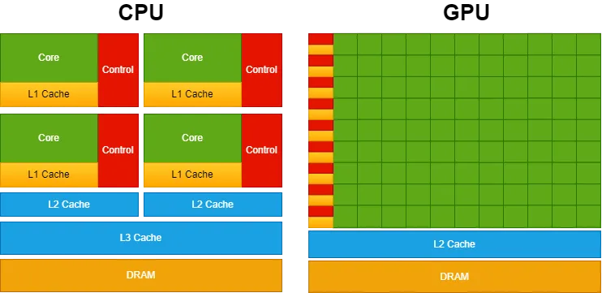
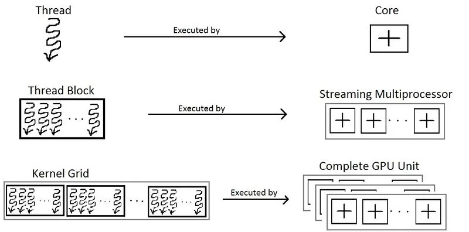
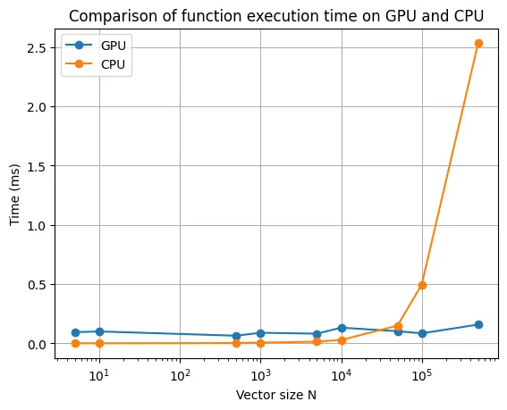
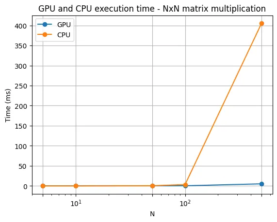
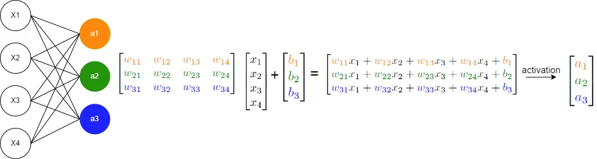

# cuda编程指南

翻译自[链接](https://towardsdatascience.com/why-deep-learning-models-run-faster-on-gpus-a-brief-introduction-to-cuda-programming-035272906d66)

如今，当我们谈论深度学习时，通常会将其实现与利用 GPU 关联起来，以提高性能。

GPU（图形处理单元）最初是为了加速图像、2D 和 3D 图形的渲染而设计的。然而，由于它们能够执行许多并行操作，它们的用途超出了图形渲染，扩展到深度学习等应用。

使用 GPU 进行深度学习模型的开发始于 2000 年代中期至后期，并在 2012 年随着 AlexNet 的出现而变得非常流行。AlexNet 是由 Alex Krizhevsky、Ilya Sutskever 和 Geoffrey Hinton 设计的卷积神经网络，它在 2012 年赢得了 ImageNet 大规模视觉识别挑战赛（ILSVRC）。这一胜利标志着一个里程碑，因为它展示了深度神经网络在图像分类中的有效性以及使用 GPU 训练大型模型的优势。

随着这一突破，使用 GPU 进行深度学习模型的应用变得越来越普及，这促成了像 PyTorch 和 TensorFlow 等框架的出现。

如今，在 PyTorch 中，我们只需写 `.to("cuda")` 将数据发送到 GPU，并期望训练能够加速。但是，深度学习算法如何在实践中利用 GPU 的计算性能呢？让我们来看看！

深度学习架构如神经网络、卷积神经网络（CNN）、循环神经网络（RNN）和变换器（transformers）基本上是通过数学运算构建的，例如矩阵加法、矩阵乘法和对矩阵应用函数。因此，如果我们找到优化这些运算的方法，就可以提高深度学习模型的性能。

那么，让我们从简单的开始。假设你想要将两个向量相加，$C = A + B$。



在 C 语言中，这可以简单实现为：

```c
void AddTwoVectors(flaot A[], float B[], float C[]) {
    for (int i = 0; i < N; i++) {
        C[i] = A[i] + B[i];
    }
}
```

正如你所注意到的，计算机必须遍历向量，在每次迭代中顺序地相加每对元素。但是，这些操作彼此独立。第 i 对元素的相加并不依赖于其他任何一对。那么，如果我们能够并发地执行这些操作，同时加上所有的元素对，会怎样呢？

一种简单的方法是使用 CPU 多线程来并行运行所有计算。然而，当涉及到深度学习模型时，我们处理的是具有数百万个元素的大型向量。普通的 CPU 同时只能处理大约十几个线程。这时，GPU 就派上用场了！现代 GPU 可以同时运行数百万个线程，从而提高对大型向量进行这些数学运算的性能。

## CPU vs GPU

尽管 CPU 在单个操作的计算上可能比 GPU 更快，但 GPU 的优势在于其并行化能力。原因在于它们的设计目标不同。CPU 的设计目的是尽可能快速地执行一系列操作（线程），并且只能同时执行几十个线程；而 GPU 的设计则是为了并行执行数百万个操作（虽然牺牲了单个线程的速度）。

为了说明这一点，可以想象 CPU 像一辆法拉利，而 GPU 像一辆公交车。如果你的任务是移动一个人，法拉利（CPU）是更好的选择。然而，如果你要移动几个人，尽管法拉利（CPU）每次出行的速度更快，但公交车（GPU）可以一次性运输所有人，比法拉利多次往返的速度更快。因此，CPU 更适合处理顺序操作，而 GPU 更适合处理并行操作。

为了提供更高的并行能力，GPU 设计分配了更多的晶体管用于数据处理，而不是数据缓存和流控制，这与 CPU 的设计不同，后者为了优化单线程性能和复杂指令执行，分配了相当大一部分晶体管用于这些目的。

下图展示了 CPU 和 GPU 的芯片资源分配情况。



CPU 拥有强大的核心和更复杂的缓存存储器架构（为此分配了大量的晶体管）。这种设计使得顺序操作的处理速度更快。另一方面，GPU 优先考虑拥有大量核心，以实现更高水平的并行性。

现在我们理解了这些基本概念，如何在实践中利用这种并行计算能力呢？

## cuda简介

当你运行某个深度学习模型时，你可能会选择使用一些流行的 Python 库，如 PyTorch 或 TensorFlow。然而，众所周知，这些库的核心在底层运行的是 C/C++ 代码。此外，正如我们之前提到的，你可能会使用 GPU 来加速处理。这就是 CUDA 的作用！CUDA 代表计算统一架构（Compute Unified Architecture），是 NVIDIA 开发的一个平台，用于在其 GPU 上进行通用处理。因此，虽然游戏引擎使用 DirectX 来处理图形计算，但 CUDA 使开发者能够将 NVIDIA 的 GPU 计算能力集成到他们的通用软件应用中，超越了仅仅图形渲染的范围。

为了实现这一点，CUDA 提供了一个简单的基于 C/C++ 的接口（CUDA C/C++），允许访问 GPU 的虚拟指令集和特定操作（例如在 CPU 和 GPU 之间移动数据）。

在我们进一步讨论之前，让我们了解一些基本的 CUDA 编程概念和术语：

- **host**: 指的是 CPU 及其内存；
- **device**: 指的是 GPU 及其内存；
- **kernel**: 指的是在设备（GPU）上执行的函数；

因此，在使用 CUDA 编写的基本代码中，程序在主机（CPU）上运行，将数据发送到设备（GPU），并启动在设备（GPU）上执行的内核（函数）。这些内核由多个线程并行执行。执行完成后，结果从设备（GPU）传回主机（CPU）。

现在让我们回到我们加两个向量的问题：

```c
#include <stdio.h>

void AddTwoVectors(flaot A[], float B[], float C[]) {
    for (int i = 0; i < N; i++) {
        C[i] = A[i] + B[i];
    }
}

int main() {
    ...
    AddTwoVectors(A, B, C);
    ...
}
```

在 CUDA C/C++ 中，程序员可以定义 C/C++ 函数，称为内核（kernels），当调用时，这些内核会被 N 个不同的 CUDA 线程并行执行 N 次。

要定义一个内核，可以使用 `__global__` 声明修饰符，而执行该内核的 CUDA 线程数量可以使用 `<<<...>>>` 符号来指定：

```c
#include <stdio.h>

// Kernel definition
__global__ void AddTwoVectors(float A[], float B[], float C[]) {
    int i = threadIdx.x;
    C[i] = A[i] + B[i];
}

int main() {
    ...
    // Kernel invocation with N threads
    AddTwoVectors<<<1, N>>>(A, B, C);
    ...
}
```

每个线程执行内核，并通过内置变量获得一个唯一的线程 ID `threadIdx`，该 ID 可以在内核内访问。上述代码将大小为 N 的两个向量 A 和 B 相加，并将结果存储到向量 C 中。可以注意到，CUDA 允许我们使用 N 个线程并行执行所有这些操作，而不是使用循环顺序地执行每对相加。

但在我们运行这段代码之前，我们需要进行另一个修改。重要的是要记住，内核函数在设备（GPU）上运行。因此，所有数据都需要存储在设备内存中。你可以使用以下 CUDA 内置函数来实现这一点：

```c
#include <stdio.h>

// Kernel definition
__global__ void AddTwoVectors(float A[], float B[], float C[]) {
    int i = threadIdx.x;
    C[i] = A[i] + B[i];
}

int main() {

    int N = 1000; // Size of the vectors
    float A[N], B[N], C[N]; // Arrays for vectors A, B, and C

    ...

    float *d_A, *d_B, *d_C; // Device pointers for vectors A, B, and C

    // Allocate memory on the device for vectors A, B, and C
    cudaMalloc((void **)&d_A, N * sizeof(float));
    cudaMalloc((void **)&d_B, N * sizeof(float));
    cudaMalloc((void **)&d_C, N * sizeof(float));

    // Copy vectors A and B from host to device
    cudaMemcpy(d_A, A, N * sizeof(float), cudaMemcpyHostToDevice);
    cudaMemcpy(d_B, B, N * sizeof(float), cudaMemcpyHostToDevice);

    // Kernel invocation with N threads
    AddTwoVectors<<<1, N>>>(d_A, d_B, d_C);
    
    // Copy vector C from device to host
    cudaMemcpy(C, d_C, N * sizeof(float), cudaMemcpyDeviceToHost);

}
```

我们需要使用指针，而不是直接将变量 A、B 和 C 传递给内核。在 CUDA 编程中，你不能在内核启动（`<<<...>>>`）中直接使用主机数组（如示例中的 A、B 和 C）。CUDA 内核在设备内存上操作，因此你需要将设备指针（d_A、d_B 和 d_C）传递给内核，以便它能在上面操作。

此外，我们需要使用 `cudaMalloc` 在设备上分配内存，并使用 `cudaMemcpy` 在主机和设备之间复制数据。

现在我们可以添加向量 A 和 B 的初始化，并在代码末尾刷新 CUDA 内存。

```c
#include <stdio.h>

// Kernel definition
__global__ void AddTwoVectors(float A[], float B[], float C[]) {
    int i = threadIdx.x;
    C[i] = A[i] + B[i];
}

int main() {
    
    int N = 1000; // Size of the vectors
    float A[N], B[N], C[N]; // Arrays for vectors A, B, and C

    // Initialize vectors A and B
    for (int i = 0; i < N; ++i) {
        A[i] = 1;
        B[i] = 3;
    }

    float *d_A, *d_B, *d_C; // Device pointers for vectors A, B, and C

    // Allocate memory on the device for vectors A, B, and C
    cudaMalloc((void **)&d_A, N * sizeof(float));
    cudaMalloc((void **)&d_B, N * sizeof(float));
    cudaMalloc((void **)&d_C, N * sizeof(float));

    // Copy vectors A and B from host to device
    cudaMemcpy(d_A, A, N * sizeof(float), cudaMemcpyHostToDevice);
    cudaMemcpy(d_B, B, N * sizeof(float), cudaMemcpyHostToDevice);

    // Kernel invocation with N threads
    AddTwoVectors<<<1, N>>>(d_A, d_B, d_C);
    
    // Copy vector C from device to host
    cudaMemcpy(C, d_C, N * sizeof(float), cudaMemcpyDeviceToHost);

    // Free device memory
    cudaFree(d_A);
    cudaFree(d_B);
    cudaFree(d_C);
}
```

此外，我们需要在调用内核后添加 `cudaDeviceSynchronize();`。这是一个用于同步主机线程与设备的函数。当调用此函数时，主机线程将等待直到设备上所有之前发出的 CUDA 命令完成后才继续执行。

此外，添加一些 CUDA 错误检查也很重要，这样我们可以识别 GPU 上的错误。如果不添加此检查，代码将继续执行主机线程（CPU），并且很难识别与 CUDA 相关的错误。

以下是这两种技术的实现：

```c
#include <stdio.h>

// Kernel definition
__global__ void AddTwoVectors(float A[], float B[], float C[]) {
    int i = threadIdx.x;
    C[i] = A[i] + B[i];
}

int main() {
    
    int N = 1000; // Size of the vectors
    float A[N], B[N], C[N]; // Arrays for vectors A, B, and C

    // Initialize vectors A and B
    for (int i = 0; i < N; ++i) {
        A[i] = 1;
        B[i] = 3;
    }

    float *d_A, *d_B, *d_C; // Device pointers for vectors A, B, and C

    // Allocate memory on the device for vectors A, B, and C
    cudaMalloc((void **)&d_A, N * sizeof(float));
    cudaMalloc((void **)&d_B, N * sizeof(float));
    cudaMalloc((void **)&d_C, N * sizeof(float));

    // Copy vectors A and B from host to device
    cudaMemcpy(d_A, A, N * sizeof(float), cudaMemcpyHostToDevice);
    cudaMemcpy(d_B, B, N * sizeof(float), cudaMemcpyHostToDevice);

    // Kernel invocation with N threads
    AddTwoVectors<<<1, N>>>(d_A, d_B, d_C);

    // Check for error
    cudaError_t error = cudaGetLastError();
    if(error != cudaSuccess) {
        printf("CUDA error: %s\n", cudaGetErrorString(error));
        exit(-1);
    }
    
    // Waits untill all CUDA threads are executed
    cudaDeviceSynchronize();
    
    // Copy vector C from device to host
    cudaMemcpy(C, d_C, N * sizeof(float), cudaMemcpyDeviceToHost);

    // Free device memory
    cudaFree(d_A);
    cudaFree(d_B);
    cudaFree(d_C);
}
```

要编译和运行 CUDA 代码，你需要确保系统上安装了 CUDA 工具包。然后，你可以使用 NVIDIA CUDA 编译器 nvcc 来编译代码。如果你的机器上没有 GPU，你可以使用 Google Colab。你只需在“运行时” → “笔记本设置”中选择一个 GPU，然后将代码保存为 example.cu 文件并运行：

```sh
%%shell
nvcc example.cu -o compiled_example # compile
./compiled_example # run

# you can also run the code with bug detection sanitizer
compute-sanitizer --tool memcheck ./compiled_example 
```

然而，我们的代码仍然没有完全优化。上述示例使用的向量大小为 N = 1000，但这个数字较小，无法充分展示 GPU 的并行化能力。此外，在处理深度学习问题时，我们通常处理的是具有数百万个参数的大型向量。然而，如果我们尝试设置，例如 N = 500000，并使用上述示例以 `<<<1, 500000>>>` 运行内核，它会抛出错误。因此，为了改进代码并执行这样的操作，我们首先需要理解 CUDA 编程中的一个重要概念：线程层次结构。

## 线程层次结构

内核函数的调用使用符号 `<<<number_of_blocks, threads_per_block>>>`。因此，在我们上述的示例中，我们运行了 1 个块，包含 N 个 CUDA 线程。然而，每个块对其支持的线程数量有一个限制。这是因为块内的每个线程必须位于同一个流式多处理器核心上，并且必须共享该核心的内存资源。

你可以使用以下代码片段获取这个限制：

```c
int device;
cudaDeviceProp props;
cudaGetDevice(&device);
cudaGetDeviceProperties(&props, device);
printf("Maximum threads per block: %d\n", props.maxThreadsPerBlock);
```

在当前的 Colab GPU 上，一个线程块最多可以包含 1024 个线程。因此，我们需要更多的块来执行更多的线程，以处理示例中的大型向量。此外，块被组织成网格，如下所示：



现在，可以使用以下方式访问线程 ID：

```c
int i = blockIdx.x * blockDim.x + threadIdx.x;
```

因此，我们的脚本变为：

```c
#include <stdio.h>

// Kernel definition
__global__ void AddTwoVectors(float A[], float B[], float C[], int N) {
    int i = blockIdx.x * blockDim.x + threadIdx.x;
    if (i < N) // To avoid exceeding array limit
        C[i] = A[i] + B[i];
}

int main() {
    int N = 500000; // Size of the vectors
    int threads_per_block;
    int device;
    cudaDeviceProp props;
    cudaGetDevice(&device);
    cudaGetDeviceProperties(&props, device);
    threads_per_block = props.maxThreadsPerBlock;
    printf("Maximum threads per block: %d\n", threads_per_block); // 1024

    float A[N], B[N], C[N]; // Arrays for vectors A, B, and C

    // Initialize vectors A and B
    for (int i = 0; i < N; ++i) {
        A[i] = 1;
        B[i] = 3;
    }

    float *d_A, *d_B, *d_C; // Device pointers for vectors A, B, and C

    // Allocate memory on the device for vectors A, B, and C
    cudaMalloc((void **)&d_A, N * sizeof(float));
    cudaMalloc((void **)&d_B, N * sizeof(float));
    cudaMalloc((void **)&d_C, N * sizeof(float));

    // Copy vectors A and B from host to device
    cudaMemcpy(d_A, A, N * sizeof(float), cudaMemcpyHostToDevice);
    cudaMemcpy(d_B, B, N * sizeof(float), cudaMemcpyHostToDevice);

    // Kernel invocation with multiple blocks and threads_per_block threads per block
    int number_of_blocks = (N + threads_per_block - 1) / threads_per_block;
    AddTwoVectors<<<number_of_blocks, threads_per_block>>>(d_A, d_B, d_C, N);

    // Check for error
    cudaError_t error = cudaGetLastError();
    if (error != cudaSuccess) {
        printf("CUDA error: %s\n", cudaGetErrorString(error));
        exit(-1);
    }

    // Wait until all CUDA threads are executed
    cudaDeviceSynchronize();

    // Copy vector C from device to host
    cudaMemcpy(C, d_C, N * sizeof(float), cudaMemcpyDeviceToHost);

    // Free device memory
    cudaFree(d_A);
    cudaFree(d_B);
    cudaFree(d_C);

}
```

## 性能比较

下面是 CPU 和 GPU 在不同向量大小下执行两个向量相加操作的比较：



可以看出，GPU 处理的优势在于大向量大小 N 时才显现出来。此外，请记住，这个时间比较仅考虑了内核/函数的执行时间，并没有考虑主机和设备之间复制数据的时间。虽然在大多数情况下这可能并不显著，但在我们的例子中，由于我们仅执行简单的加法操作，这个时间相对较长。因此，重要的是要记住，GPU 计算只有在处理计算密集型且高度并行化的任务时，才能展示其优势。

## 多维线程

好的，现在我们知道如何提高简单数组操作的性能。但是在处理深度学习模型时，我们需要处理矩阵和张量操作。在之前的示例中，我们只使用了一维块和 N 个线程。然而，也可以执行多维线程块（最多 3 个维度）。因此，为了方便起见，如果需要进行矩阵操作，你可以运行一个 NxM 线程的线程块。在这种情况下，你可以获得矩阵的行列索引，分别为 `row = threadIdx.x` 和 `col = threadIdx.y`。此外，为了方便，你可以使用 `dim3` 变量类型来定义 `number_of_blocks` 和 `threads_per_block`。

下面的示例演示了如何相加两个矩阵。

```c
#include <stdio.h>

// Kernel definition
__global__ void AddTwoMatrices(float A[N][N], float B[N][N], float C[N][N]) {
    int i = threadIdx.x;
    int j = threadIdx.y;
    C[i][j] = A[i][j] + B[i][j];
}

int main() {
    ...
    // Kernel invocation with 1 block of NxN threads
    dim3 threads_per_block(N, N);
    AddTwoMatrices<<<1, threads_per_block>>>(A, B, C);
    ...
}
```

你还可以扩展这个示例来处理多个块：

```c
#include <stdio.h>

// Kernel definition
__global__ void AddTwoMatrices(float A[N][N], float B[N][N], float C[N][N]) {
    int i = blockIdx.x * blockDim.x + threadIdx.x;
    int j = blockIdx.y * blockDim.y + threadIdx.y;
    if (i < N && j < N) {
        C[i][j] = A[i][j] + B[i][j];
    }
}

int main() {
    ...
    // Kernel invocation with 1 block of NxN threads
    dim3 threads_per_block(32, 32);
    dim3 number_of_blocks((N + threads_per_block.x - 1) ∕ threads_per_block.x, (N + threads_per_block.y - 1) ∕ threads_per_block.y);
    AddTwoMatrices<<<number_of_blocks, threads_per_block>>>(A, B, C);
    ...
}
```

你还可以扩展这个示例来处理三维操作，使用相同的思路。

现在你知道如何操作多维数据，还有一个重要且简单的概念需要学习：如何在内核中调用函数。基本上，这可以通过使用 `__device__` 声明修饰符来简单实现。这定义了可以被设备（GPU）直接调用的函数。因此，它们只能从 `__global__` 或另一个 `__device__` 函数中调用。下面的示例对一个向量应用 sigmoid 操作（在深度学习模型中非常常见的操作）。

```c
#include <math.h>

// Sigmoid function
__device__ float sigmoid(float x) {
    return 1 / (1 + expf(-x));
}

// Kernel definition for applying sigmoid function to a vector
__global__ void sigmoidActivation(float input[], float output[]) {
    int i = threadIdx.x;
    output[i] = sigmoid(input[i]);
   
}
```

所以，现在你知道了 CUDA 编程的一些基本重要概念，你可以开始创建 CUDA 内核。在深度学习模型的情况下，它们基本上是一系列矩阵和张量操作，例如加法、乘法、卷积、归一化等。例如，一个简单的矩阵乘法算法可以如下并行化：


```c
// GPU version

__global__ void matMul(float A[M][N], float B[N][P], float C[M][P]) {
    int row = blockIdx.x * blockDim.x + threadIdx.x;
    int col = blockIdx.y * blockDim.y + threadIdx.y;

    if (row < M && col < P) {
        float C_value = 0;
        for (int i = 0; i < N; i++) {
            C_value += A[row][i] * B[i][col];
        }
        C[row][col] = C_value;
    }
}
```

现在将其与下面的普通 CPU 实现的两个矩阵乘法进行比较：

```c
// CPU version

void matMul(float A[M][N], float B[N][P], float C[M][P]) {
    for (int row = 0; row < M; row++) {
        for (int col = 0; col < P; col++) {
            float C_value = 0;
            for (int i = 0; i < N; i++) {
                C_value += A[row][i] * B[i][col];
            }
            C[row][col] = C_value;
        }
    }
}
```

你会注意到在 GPU 版本中，我们的循环较少，从而导致操作的处理速度更快。下面是 CPU 和 GPU 在 NxN 矩阵乘法中的性能比较：



正如你所观察到的，随着矩阵大小的增加，GPU 处理的性能提升在矩阵乘法操作中更加明显。

现在，考虑一个基本的神经网络，它主要涉及 `y = σ(Wx + b)` 操作，如下所示：



这些操作主要包括矩阵乘法、矩阵加法和对数组应用函数，所有这些你已经熟悉并掌握了并行化技术。因此，你现在能够从零开始实现自己的 GPU 运行的神经网络！

## 结论

在这篇文章中，我们介绍了有关 GPU 处理的基础概念，以提高深度学习模型的性能。然而，值得一提的是，你所看到的概念只是基础，还有很多内容需要学习。像 PyTorch 和 TensorFlow 这样的库实现了优化技术，涉及其他更复杂的概念，如优化的内存访问、批处理操作等（它们利用了构建在 CUDA 之上的库，如 cuBLAS 和 cuDNN）。不过，我希望这篇文章能帮助你了解在你写 `.to("cuda")` 并在 GPU 上执行深度学习模型时，背后发生了什么。

在未来的文章中，我将尝试带来有关 CUDA 编程的更复杂概念。请在评论中告诉我你的想法或你希望我接下来写些什么！非常感谢你的阅读！😊

## Further reading

[CUDA Programming Guide](https://docs.nvidia.com/cuda/pdf/CUDA_C_Programming_Guide.pdf) — NVIDIA CUDA Programming documentation.

[CUDA Documentation](https://docs.nvidia.com/cuda/) — NVIDIA complete CUDA documentation.

[CUDA Neural Network training implementation](https://luniak.io/cuda-neural-network-implementation-part-1/) — Pure CUDA C++ implementation of a neural network training.

[CUDA LLM training implementation](https://github.com/karpathy/llm.c) — Training implementation of LLM with pure CUDA C.