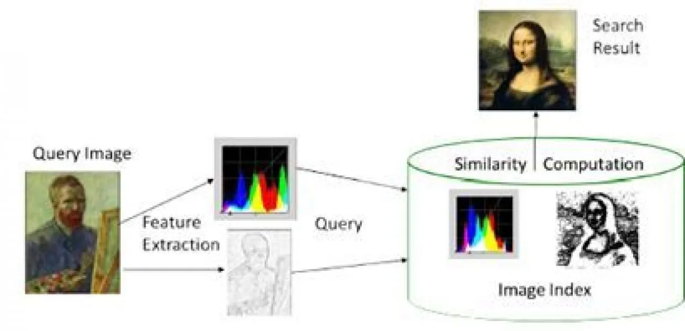
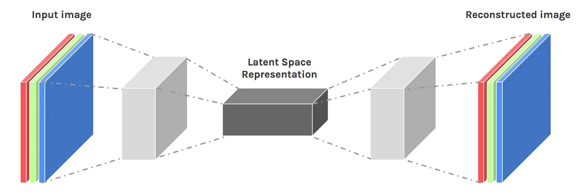
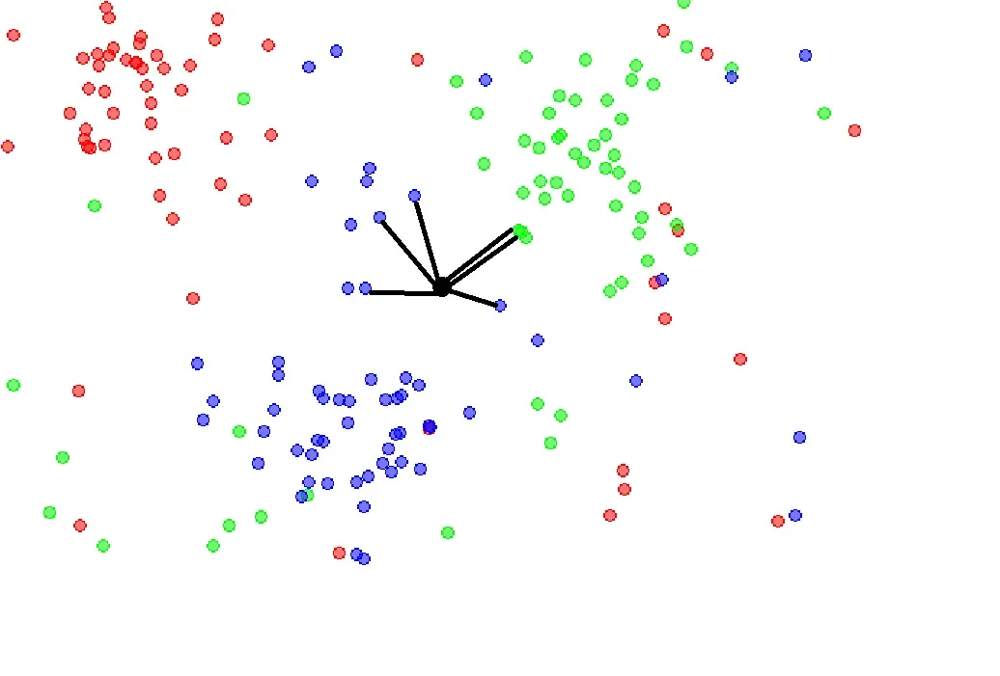
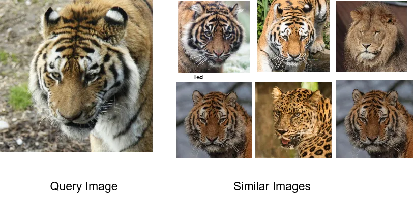
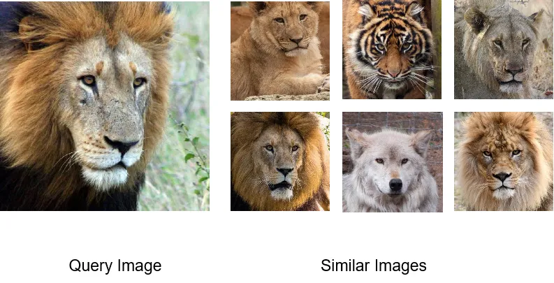

# Image Similarity Search in PyTorch

这篇博客文章将指导您如何使用 PyTorch 创建一个简单的图像相似性搜索引擎。这个教程非常适合对计算机视觉感兴趣的机器学习初学者。

## 图像相似性搜索问题

问题很简单。我们从用户那里获得一张图像。我们有一个可用的大量图像集合。我们想要计算与给定图像相似的图像。



要在图像上进行搜索，我们首先需要理解如何“学习”图像。如果我们的算法理解图像的外观，它就能够找到相似的图像。因此，我们面临的第一个挑战是学习如何表示这些图像。

## 使用自编码器学习

假设我们学习重建一张图像。在重建图像的过程中，我们需要了解图像的外观。这一概念由一个称为卷积编码器的“编码网络”来捕捉。卷积编码器将图像转换为特征表示。这些“特征表示”有助于识别图像。

为了重建图像，我们还需要将这些“特征表示”转换回原始图像。为此，我们使用一个称为卷积解码器的“解码网络”。卷积解码器从其特征表示中重建图像。

简而言之，我们有以下内容：

```py
encoded_image = encoder(input_image)
reconstructed_image = decoder(encoded_image)
```

这两个网络协同工作。一个网络尝试学习如何将图像转换为特征，而另一个网络则专注于如何将这些特征转换回原始图像。它们在学习过程中相互帮助。



这种通过表示学习的方式称为“表示学习”。在这里，我们的目标是找到合适的“表示”或“特征”，以描述我们的数据。在此过程中，我们并没有对数据集中的图像进行标记。我们有数百或数千张图像，希望从中推荐一张相似的图像。因此，这种方法是一种“无监督学习方法”。

## 从想法到代码，使用 PyTorch

让我们将这些想法转化为代码。PyTorch 使这一过程非常简单。我们将创建我们的 `dataset` 类和用于训练的 `model`。

### 数据集类

以下是一个简单的数据集类，用于将文件夹中的所有图像转换为 PyTorch 数据集。

```py
class FolderDataset(Dataset):
    """
    Creates a PyTorch dataset from folder, returning two tensor images.
    Args: 
    main_dir : directory where images are stored.
    transform (optional) : torchvision transforms to be applied while making dataset
    """

    def __init__(self, main_dir, transform=None):
        self.main_dir = main_dir
        self.transform = transform
        self.all_imgs = os.listdir(main_dir)

    def __len__(self):
        return len(self.all_imgs)

    def __getitem__(self, idx):
        img_loc = os.path.join(self.main_dir, self.all_imgs[idx])
        image = Image.open(img_loc).convert("RGB")

        if self.transform is not None:
            tensor_image = self.transform(image)

        return tensor_image, tensor_image
```

在这里，我们返回两张图像。一张作为我们模型的输入，另一张用于与原始图像进行重建比较。

## 模型

我们的编码器模型由卷积层、ReLU 激活层和最大池化层的重复组合构成。

```py
class ConvEncoder(nn.Module):
    """
    A simple Convolutional Encoder Model
    """

    def __init__(self):
        super().__init__()

        self.conv1 = nn.Conv2d(3, 16, (3, 3), padding=(1, 1))
        self.relu1 = nn.ReLU(inplace=True)
        self.maxpool1 = nn.MaxPool2d((2, 2))

        self.conv2 = nn.Conv2d(16, 32, (3, 3), padding=(1, 1))
        self.relu2 = nn.ReLU(inplace=True)
        self.maxpool2 = nn.MaxPool2d((2, 2))

        self.conv3 = nn.Conv2d(32, 64, (3, 3), padding=(1, 1))
        self.relu3 = nn.ReLU(inplace=True)
        self.maxpool3 = nn.MaxPool2d((2, 2))

        self.conv4 = nn.Conv2d(64, 128, (3, 3), padding=(1, 1))
        self.relu4 = nn.ReLU(inplace=True)
        self.maxpool4 = nn.MaxPool2d((2, 2))

        self.conv5 = nn.Conv2d(128, 256, (3, 3), padding=(1, 1))
        self.relu5 = nn.ReLU(inplace=True)
        self.maxpool5 = nn.MaxPool2d((2, 2))

    def forward(self, x):
        # Downscale the image with conv maxpool etc.
        x = self.conv1(x)
        x = self.relu1(x)
        x = self.maxpool1(x)

        x = self.conv2(x)
        x = self.relu2(x)
        x = self.maxpool2(x)

        x = self.conv3(x)
        x = self.relu3(x)
        x = self.maxpool3(x)

        x = self.conv4(x)
        x = self.relu4(x)
        x = self.maxpool4(x)

        x = self.conv5(x)
        x = self.relu5(x)
        x = self.maxpool5(x)

        return x
```

因此，编码器模型将我们的输入图像转换为大小为 (1, 256, 16, 16) 的特征表示。可以通过将一个虚拟图像传递给编码器来计算这个特征表示。这个特征表示作为输入传递给我们的解码器模型。

```py
class ConvDecoder(nn.Module):
    """
    A simple Convolutional Decoder Model
    """

    def __init__(self):
        super().__init__()
        self.deconv1 = nn.ConvTranspose2d(256, 128, (2, 2), stride=(2, 2))
        self.relu1 = nn.ReLU(inplace=True)

        self.deconv2 = nn.ConvTranspose2d(128, 64, (2, 2), stride=(2, 2))
        self.relu2 = nn.ReLU(inplace=True)

        self.deconv3 = nn.ConvTranspose2d(64, 32, (2, 2), stride=(2, 2))
        self.relu3 = nn.ReLU(inplace=True)

        self.deconv4 = nn.ConvTranspose2d(32, 16, (2, 2), stride=(2, 2))
        self.relu4 = nn.ReLU(inplace=True)

        self.deconv5 = nn.ConvTranspose2d(16, 3, (2, 2), stride=(2, 2))
        self.relu5 = nn.ReLU(inplace=True)

    def forward(self, x):
         # Upscale the image with convtranspose etc.
        x = self.deconv1(x)
        x = self.relu1(x)

        x = self.deconv2(x)
        x = self.relu2(x)

        x = self.deconv3(x)
        x = self.relu3(x)

        x = self.deconv4(x)
        x = self.relu4(x)

        x = self.deconv5(x)
        x = self.relu5(x)
        return x
```

解码器接受特征表示作为输入，并重建回图像。我们使用核大小为 (2, 2) 和步幅为 (2, 2) 的转置卷积层将特征表示上采样到原始图像的大小。

## 训练和保存特征表示

训练我们的图像相似性模型很简单。我们创建 PyTorch 的 `dataset` 和 `dataloaders`。为了测量重建图像与原始图像之间的差异，我们使用均方误差损失（Mean Squared Error loss）。它测量两者之间的总体平方差。

```py
# Simplified Training Script
import torch
import torchvision.transforms as T

transforms = T.Compose([T.ToTensor()]) # Normalize the pixels and convert to tensor.

full_dataset = FolderDataset("../data/", transforms) # Create folder dataset.

train_size = 0.75
val_size = 1 - train_size

# Split data to train and test
train_dataset, val_dataset = torch.utils.data.random_split(full_dataset, [train_size, val_size])

# Create the train dataloader
train_loader = torch.utils.data.DataLoader(train_dataset, batch_size=32, shuffle=True)

# Create the validation dataloader
val_loader = torch.utils.data.DataLoader(val_dataset, batch_size=32)

# Create the full dataloader
full_loader = torch.utils.data.DataLoader(full_dataset, batch_size=32)

loss_fn = nn.MSELoss() # We use Mean squared loss which computes difference between two images.

encoder = ConvEncoder() # Our encoder model
decoder = ConvDecoder() # Our decoder model

device = "cuda"  # GPU device

# Shift models to GPU
encoder.to(device)
decoder.to(device)

# Both the enocder and decoder parameters
autoencoder_params = list(encoder.parameters()) + list(decoder.parameters())
optimizer = optim.Adam(autoencoder_params, lr=1e-3) # Adam Optimizer

# Time to Train !!!
EPOCHS = 10
# Usual Training Loop
for epoch in tqdm(range(EPOCHS)):
        train_loss = train_step(encoder, decoder, train_loader, loss_fn, optimizer, device=device)
        
        print(f"Epochs = {epoch}, Training Loss : {train_loss}")
        
        val_loss = val_step(encoder, decoder, val_loader, loss_fn, device=device)
        
        print(f"Epochs = {epoch}, Validation Loss : {val_loss}")

        # Simple Best Model saving
        if val_loss < max_loss:
            print("Validation Loss decreased, saving new best model")
            torch.save(encoder.state_dict(), "encoder_model.pt")
            torch.save(decoder.state_dict(), "decoder_model.pt")

# Save the feature representations.
EMBEDDING_SHAPE = (1, 256, 16, 16) # This we know from our encoder

# We need feature representations for complete dataset not just train and validation.
# Hence we use full loader here.
embedding = create_embedding(encoder, full_loader, EMBEDDING_SHAPE, device)

# Convert embedding to numpy and save them
numpy_embedding = embedding.cpu().detach().numpy()
num_images = numpy_embedding.shape[0]

# Save the embeddings for complete dataset, not just train
flattened_embedding = numpy_embedding.reshape((num_images, -1))
np.save("data_embedding.npy", flattened_embedding)
```

我们的训练步骤和验证步骤函数很简单。我们将训练图像输入到编码器中。编码器的输出经过解码器处理。这个重建的图像用于计算损失，我们将其返回。

```py
def train_step(encoder, decoder, train_loader, loss_fn, optimizer, device):
    """
    Performs a single training step
    Args:
    encoder: A convolutional Encoder. E.g. torch_model ConvEncoder
    decoder: A convolutional Decoder. E.g. torch_model ConvDecoder
    train_loader: PyTorch dataloader, containing (images, images).
    loss_fn: PyTorch loss_fn, computes loss between 2 images.
    optimizer: PyTorch optimizer.
    device: "cuda" or "cpu"
    Returns: Train Loss
    """
    #  Set networks to train mode.
    encoder.train()
    decoder.train()

    for batch_idx, (train_img, target_img) in enumerate(train_loader):
        # Move images to device
        train_img = train_img.to(device)
        target_img = target_img.to(device)

        # Zero grad the optimizer
        optimizer.zero_grad()
        # Feed the train images to encoder
        enc_output = encoder(train_img)
        # The output of encoder is input to decoder !
        dec_output = decoder(enc_output)

        # Decoder output is reconstructed image
        # Compute loss with it and orginal image which is target image.
        loss = loss_fn(dec_output, target_img)
        # Backpropogate
        loss.backward()
        # Apply the optimizer to network by calling step.
        optimizer.step()
    # Return the loss
    return loss.item()

def val_step(encoder, decoder, val_loader, loss_fn, device):
    """
    Performs a single training step
    Args:
    encoder: A convolutional Encoder. E.g. torch_model ConvEncoder
    decoder: A convolutional Decoder. E.g. torch_model ConvDecoder
    val_loader: PyTorch dataloader, containing (images, images).
    loss_fn: PyTorch loss_fn, computes loss between 2 images.
    device: "cuda" or "cpu"
    Returns: Validation Loss
    """
    
    # Set to eval mode.
    encoder.eval()
    decoder.eval()

    # We don't need to compute gradients while validating.
    with torch.no_grad():
        for batch_idx, (train_img, target_img) in enumerate(val_loader):
            # Move to device
            train_img = train_img.to(device)
            target_img = target_img.to(device)

            # Again as train. Feed encoder the train image.
            enc_output = encoder(train_img)
            # Decoder takes encoder output and reconstructs the image.
            dec_output = decoder(enc_output)

            # Validation loss for encoder and decoder.
            loss = loss_fn(dec_output, target_img)
    # Return the loss
    return loss.item()
```

最后，我们保存数据集中所有图像的特征表示。这些被称为图像嵌入（image embeddings）。我们将它们存储为 NumPy 的 `.npy` 格式。这作为我们的“图像索引”，可以用来搜索相似的图像。

```py
def create_embedding(encoder, full_loader, embedding_dim, device):
    """
    Creates embedding using encoder from dataloader.
    encoder: A convolutional Encoder. E.g. torch_model ConvEncoder
    full_loader: PyTorch dataloader, containing (images, images) over entire dataset.
    embedding_dim: Tuple (c, h, w) Dimension of embedding = output of encoder dimesntions.
    device: "cuda" or "cpu"
    Returns: Embedding of size (num_images_in_loader + 1, c, h, w)
    """
    # Set encoder to eval mode.
    encoder.eval()
    # Just a place holder for our 0th image embedding.
    embedding = torch.randn(embedding_dim)
    
    # Again we do not compute loss here so. No gradients.
    with torch.no_grad():
        for batch_idx, (train_img, target_img) in enumerate(full_loader):
            # We can compute this on GPU. be faster
            train_img = train_img.to(device)
            
            # Get encoder outputs and move outputs to cpu
            enc_output = encoder(train_img).cpu()
            # Keep adding these outputs to embeddings.
            embedding = torch.cat((embedding, enc_output), 0)
    
    # Return the embeddings
    return embedding
```

## 搜索相似图像

太好了！现在我们已经为整个数据集获得了特征表示（嵌入）。接下来，我们需要搜索相似的图像。

需要相似图像的查询图像也可以通过我们的编码器网络转换为特征表示。暂时让我们将这些“特征表示”视为点。

我们需要找到的是“给定点的最近点”，如下图所示。



## 最后缺失的部分：最近邻搜索

让我们将这些想法转化为代码。

我们需要使用编码器将用户的图像转换为嵌入。之后，我们需要使用 K 最近邻算法（K-Nearest Neighbors）计算相似图像。

```py
def compute_similar_images(image, num_images, embedding, device):
    """
    Given an image and number of similar images to search.
    Returns the num_images closest neares images.
    Args:
    image: Image whose similar images are to be found.
    num_images: Number of similar images to find.
    embedding : A (num_images, embedding_dim) Embedding of images learnt from auto-encoder.
    device : "cuda" or "cpu" device.
    """
    
    image_tensor = T.ToTensor()(image)
    image_tensor = image_tensor.unsqueeze(0)
    
    with torch.no_grad():
        image_embedding = encoder(image_tensor).cpu().detach().numpy()
        
    flattened_embedding = image_embedding.reshape((image_embedding.shape[0], -1))

    knn = NearestNeighbors(n_neighbors=num_images, metric="cosine")
    knn.fit(embedding)

    _, indices = knn.kneighbors(flattened_embedding)
    indices_list = indices.tolist()
    return indices_list
```

我们成功地使用我们的图像相似性系统找到了与给定图像相似的图像！

让我们来看一些输出。我在一个包含动物图像的数据集上进行了训练。





对于我们简单的图像搜索系统来说，效果确实不错。

## 最后的思考

我们从零开始构建了一个基本的图像搜索系统。实现这一任务有多种方法。可以使用预训练模型，如 ResNet 或 VGG，作为特征提取器。这些模型可以直接用于创建特征表示。

此外，如果您正在寻找一个生产就绪的系统，可以使用以下库或工具：

- **FAISS**：来自 Facebook 的一个用于图像相似性搜索的库。您可以在这里找到更多信息。它是一个先进、最前沿的开源实现，具有高度可扩展性。

- **Deep Ranking**：另一种执行图像相似性的技术。它以不同的方式将问题表述为一次比较三张图像（三元组）。您可以在这篇论文中了解更多信息。

